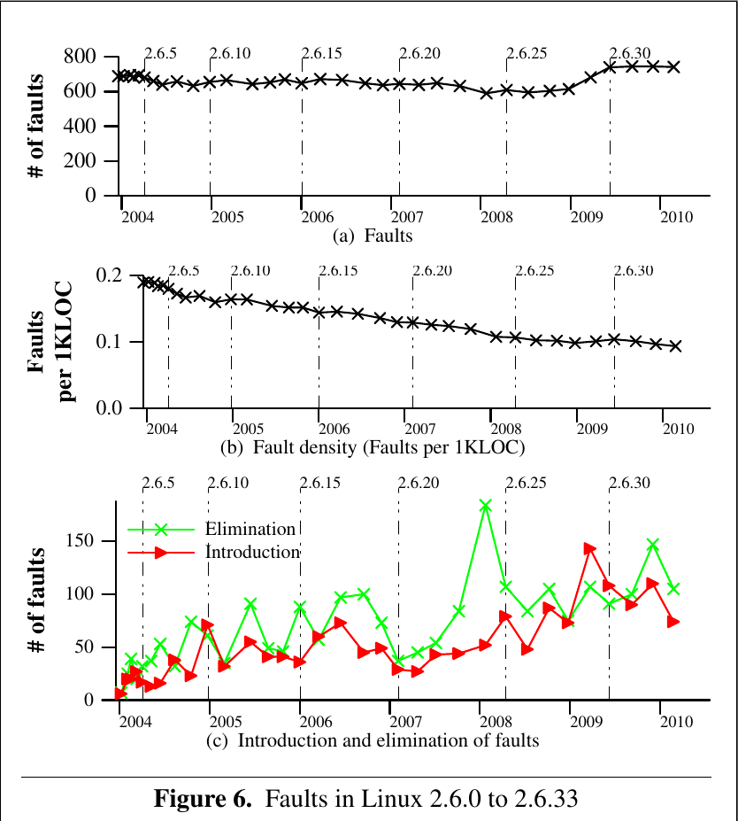
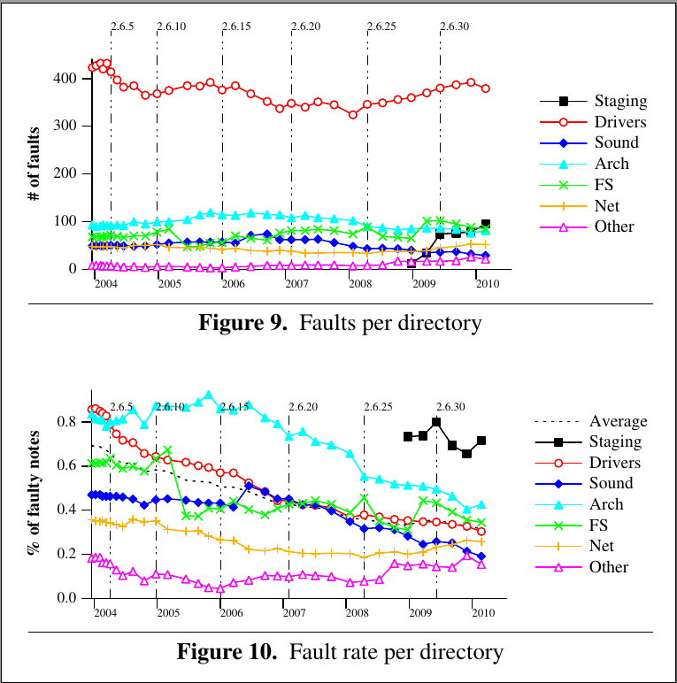

# Report for Faults in Linux: Ten Years Later

## Summary of major innovations

该篇论文主要延续了十年前的在内核找Bug的论文An empirical study of operating systems errors思路，并且与之进行比较分析后得出目前内核目前的bug趋势和十年前已经有所差异了。从以往的driver中的bug相对较多当如今的arch和sound的比例也相对上升，内核bug的修复的主要方向可以做适当调整。

## Problems the paper mentioned

这篇文章其实并没有提出什么新的问题，目的就是分析了一下十年内linux的各种bug或者fault的情况，其中难点可能就在于对于找到bug后的各种结果分析，正确发掘内核bug的一些情况可能需要具有一定对于内核的了解。另外，寻找不同版本之间源代码的bug之间的关联性以及判断是否为同一个bug具有一定的挑战性（虽然解决方案也非常的一般）

## Related works/papers

最相关的Paper也就是十年前的An empirical study of operating systems errors。这一篇主要在01年的时候发表，那个时候Linux内核还是一个刚兴起的系统。它重点分析Linux内核的各种faults的分布以及时长，并且主要是针对x86架构的，一直到2.4.1为止。当时作为一个提出了一套自动工具分析并且给出了一系列前瞻性数据分析，一直被各种引用来作为各种内核fault论断的基础。

另外，就主要是各种用于寻找linux代码的一些寻找fault的工具，比如checkpatch, coccinelle, converity, smatch和sparse.

## Intriguing aspects of the paper

1. 这篇文章我觉得最有前瞻性的地方在于尝试去分析一系列版本的linux的bug，并将bug进行了版本关联，从而在一定程度上能够发现一个bug在内核版本迭代的生死存亡。使得对于bug的分析除了分析其种类的各种数量以及比例等等，还能分析bug的生存周期，甚至于通过版本的信息来分析为何某一个时间点突然在某个模块引入大量的bug（比如新功能的引入等等）。并根据此开发了一些工具进行帮助，对于后续的内核bug分析也有很大的便捷性。
2. 另外，尽管内核人员实际上在开发的时候会去使用各种Bug分析工具，甚至有一些自动化分析工具，然而至少实际上来说并没有什么特别的有用。该有bug的地方还是会引入各种bug。
3. 十年前的那篇Paper指出了内核中driver那一部分的代码存在的bug相对比例最高，所以使得之后的内核开发人员需要重点关注的地方为内核驱动。然而也正是因为在重点放在驱动的时候，这十年来bug率有所下降，之后在arch和fs这两个模块的bug比例相对上涨，这也给了内核开发人员一个信号，需要进一步关注一下这两个模块的可靠性
4. 本文也通过实验分析说明了实际上linux内核本身是更加趋向于可靠的，这是因为尽管引入bug的数量依旧是在上涨，但是实际上bug的消减的数量上涨的更加快，这主要是因为开发的迭代效率越来越高，开发人员的素质也越来越高的原因。
5. 不过，各种寻找bug的方式其实并不是非常的新颖，本质上也是在重复十年前的那篇文章。

## Experiments: test/compare/analyze

本文首先展示了linux 2.4.1的结果（不过这个主要是复现10年前论文的结果，这里不做展示），然后就是展示了linux 2.6系列的各种实验结果，首先是总体的bug（faults）的数量等：

显然，fault的数量其实一直比较稳定，但是可以发现每千行代码的faults数量基本上是逐渐下降的，这个可以说明linux内核的可靠性有所提升。另外引入和消减faults的数量也一目了然，在2008年那个节点消减情况上涨很快。

图7和图8说明了随着时间的变迁各种类型的Faults数量的变化。不过其实整体上而言各种类型Fault的rate都是关于呈现下降趋势的，这一点可以说是内核的fault还是呈现可控趋势的。

而上述的四副图像主要就分析了对于不同目录（往往也代表着不同的模块）的Fault的各种情况，不过的确也可以发现driver中的fault数量也比arch和fs的较少。其他更多的关于fault持续时间以及开发人员等在论文中都得到了详尽的分析。

## Places the reseach can be improved

1. 首先就是这篇文章许多地方的对于bug的寻找都有些过于想当然，这应该是和十年前的想法类似。但是很明显的，比如对于Var这种类型的bug就只分析了直接声明超过1024的数组大小，而Block的初始函数也是认为制定的，而对于Size这个类型就是单纯的匹配kmalloc中的sizeof里的类型和返回值的类型是否一致等等。这样的分析有些过于粗犷了。
2. 也正是由于上面的分析过于粗犷，从而导致实际上寻找到的bug数量可能远远不止如此，也就是说，上面能找到的bug只是冰山一角而已。这样就使得文中实验部分的各种图表的意义都不是很大了，因为他只是局限在已经发现的部分中。而且这些通过简单的方式发现的很多时候一些注意的编程人员往往不会犯错，所以那些熟练编程人员易错的部分（往往后果也严重）完全不易被找到。
3. 这篇文章也提到就是可以减少False Positive，毕竟通过递归获得不动点集合以及模式匹配这样的方式并不能很好的理解内核的各种需求，所以有时候会导致各种误判。

## What I would do if i wrote this paper

如果是我来组织这篇文章的内容的话，除了他本身的组织方式意外，可能还会考虑使用另外一种组织方式，文章首先复现了Zhou的那篇文章的结果，也就是展示Linux 2.4相关的结果，然后再展示他们在2.6系列上的结果。不过还可以考虑按照不同的Bug类型来进行按照整个Linux Timeline进行展示和分析，因为除了分析文件夹（也就是内核模块）的各种趋势，其实不同Bug类型的趋势也是值得进一步分析和研究的。

## Survey Paper Lists

[1] A. Chou, J. Yang, B. Chelf, S. Hallem, and D. Engler. An empirical
study of operating systems errors. In Proceedings of the 18th ACM
Symposium on Operating System Principles, pages 73–88, Banff,
Canada, Oct. 2001.

[2] Comedi: Linux Control and Mesurement Device Interface. http:
//www.comedi.org/.

[3] Static source code analysis, static analysis, software quality tools by
Coverity Inc. http://www.coverity.com/, 2008.

