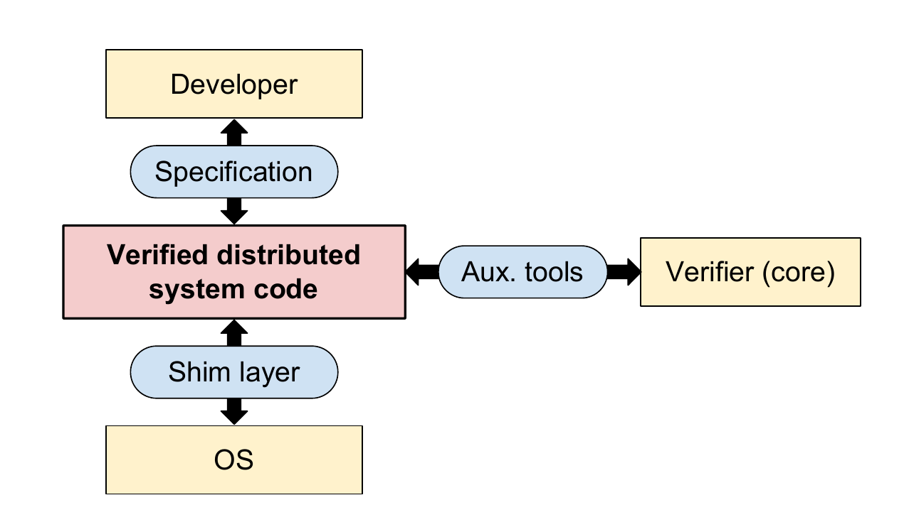

# An Empirical Study on the Correctness of Formally Verified Distributed Systems

## Summary of major innovations

在已经被形式化验证过的分布式系统上找寻实际场景的bug，这个既是他的主体，也是他最大的贡献，而且其最终贡献本身并不在与找bug，而是通过实践在一定程度上质疑形式化验证中默认的假设的合理性；同时也给开发者进一步的提示，对于实际场景而言，单纯的一类测试验证是远不够的。

并且基于他们的发现，构建了一个自动测试链意图能够找到这些类型的bug，也使得文中的各类发现能够自动化的被用到实际开发中。

## Problems the paper mentioned

实际上，就算是一个已经验证过的分布式系统可能依然并不能正确的运转，因为实际上就算你的标准写的再好，实际代码也就算能够很好的对应其标准，但是分析中依然存在各种潜在的假设，而正是这些假设会使得实际上的系统在真实运行环境下依然存在着一些使之异常的情况。而本文正是打算根据这些假设入手来进一步发现潜在的问题。

## Related works/papers

其实算是一个开创性的结果，所以也没有什么这个领域太相关的内容，文章也主要就是介绍了一下形式化验证的整个流程，也就是如下图：

简单来说，就是开发者首先需要制定一个标准(specification)，这个标准是需要人工验证过的，能够准确描述开发所需要的，然后开发者需要制定一些底层的基础设施，也就是关于OS等的抽象(shim layer)，shim layer之下的是验证过程是不会管的，然后就是开发代码的同时，使用辅助工具(aux. tools)调用证明器来检验。这里的Specification, Shim Layer和Aux.Tools整个就构成了Trusted Computing Base的一部分。

## Intriguing aspects of the paper

1. 其实，我觉得最大的一个重要点在于：打破了人们对于形式化验证过的代码的绝对信任。因为形式化验证往往存在各种存在潜在假设，而这些假设往往就是罪魁祸首，不论是对于网络通信还是操作系统等的假设，乃至于对于标准的信任都会导致各类意外情况
2. 另外，不得不承认，其实整个工作的工作量是非常可观的，因为这样类型的bug或者异常前人并没有研究过，所以需要手动的检查代码和标准一步一步经过大脑的思考才能够去判断，可以说这个寻找bug的过程基本上是人工这一点就非常值得敬佩了，而且文中也说了大概花了八个月的时间只为了寻找protocal存在的问题最后还没有找到。
3. 另外，这份工作也给了一些有意义的建议或者方向，其中提到绝大部分的bug都主要集中在接口上，这些借口往往就是和TCB（Trusted Computing Base)打交道部分。而正是因为形式化验证的正确性需要以来TCB的正确性，而开发者往往不能很好的对于TCB的正确性有一个合适的把握，从而导致了各种bug情况。这点发现其实也是对开发者的一个警醒，在开发可信赖的分布式系统需要对于TCB的部分有更多更全面的了解。
4. 另外，其实文中的发现大部分都是一些数学上的比例之类的，不过值得一提的是并没有找到Protocal的bug，这个可以说也在意料之中，毕竟protocal的正确性是分布式系统最重要，也应该是经过验证并且能够被验证的一部分。如果出错基本上得是Specification和Implementation双重出错并且匹配上，这个概率不太可能

## Experiments: test/compare/analyze

这篇文章也主要是发现类的，所以这里也就主要展示一下文章的发现BUG问题

1. Incorrect unmarshaling of client requests throws exceptions. （客户端请求的不正确的解包抛出异常）
2. Duplicate packets cause consistency violation. （重复数据包会导致一致性异常）
3. Dropped packets cause liveness problems. （丢包导致存活性问题）
4. Incorrect marshaling enables command injection. （不正确的打包使命令注入成为可能）
5. Library semantics causes safety violations. （库的语义导致安全违规）
6. Incomplete log causes crash during recovery. （不完整的日志会导致恢复期间崩溃）
7. Crash during snapshot update causes loss of data. （快照更新期间崩溃会导致数据丢失）
8. System call error causes wrong results and data loss. （系统调用错误导致错误结果和数据丢失）
9. Large packets cause server crashes. （大数据包导致服务器崩溃）
10. Failing to send a packet causes server to stop responding to clients. （未能发送数据包会导致服务器停止响应客户端）
11. Lagging follower causes stack overflow on leader. （滞后跟随者会导致堆叠溢出)
12. Incomplete high-level specification prevents verification of exactly-once semantics.  (不完整的高级规范阻止了对exactly-once语义的验证)
13. Incorrect assertion prevents verification of causal consistency in client. (不正确的断言会阻止验证客户端的因果一致性)
14. Prover crash causes incorrect validation. (证明器失败会导致验证不正确)
15. Signals cause validation of incorrect programs. （信号导致错误程序通过验证）
16. Incompatible libraries cause prover crash. （兼容的库导致证明器崩溃）

## Places the reseach can be improved

1. 其实从形式化验证的系统中找bug这个思路而言，其实整个在我看来已经做的很不错了，所以我也觉得没有什么可以进一步提升的思路
2. 不过这个想法是否可以用在其他的复杂系统上呢，正如文中已经提到了，有形式化验证过的操作系统和编译器，那么是否在那些系统中也依然存在一些潜在的假设，而我们是否也可以尝试在哪里寻找一些能够使之crash的一些情况呢？不过不知道类似的论文是否已经发表过。

## What I would do if i wrote this paper

我应该会重点突出就是形式化验证之后的系统在实际运行环境中并不是可靠的，从而引发对于形式化验证的思考，就是我们究竟应该如何相信整个系统，可能我不会话太多篇幅来说明我们找到的各种bug类型以及一些数量上的发现，而是会将更多的笔墨重点放在他的第八章，就是如何在实际场景中做到真正的Bug-Free的分布式系统，可以说这个是真的很Promising的一个活，尤其是在工程上应该会使得一系列开发方式被彻底颠覆。

## Survey Paper Lists

[1]  C. Hawblitzel, J. Howell, M. Kapritsos, J. R. Lorch, B. Parno, M. L. Roberts, S. Setty, and B. Zill. IronFleet: Proving practical distributed systems correct. In Proceedings of the 25th ACM Symposium on Operating Systems Principles (SOSP), Monterey, CA, Oct. 2015.

[2] M. Lesani, C. J. Bell, and A. Chlipala. Chapar: Certified causally consistent distributed key-value stores. In Proceedings of the 43rd ACM Symposium on Principles of Programming Languages (POPL), pages 357–370, St. Petersburg, FL, Jan. 2016.

[3] J. R. Wilcox, D. Woos, P. Panchekha, Z. Tatlock, X. Wang,M. D. Ernst, and T. Anderson. Verdi: A framework for implementing and formally verifying distributed systems. In Proceedings of the 2015 ACM SIGPLAN Conference on Programming Language Design and Implementation (PLDI), pages 357–368, Portland, OR, June 2015.

