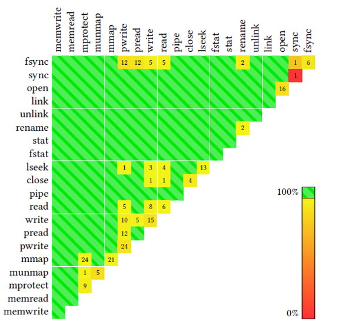
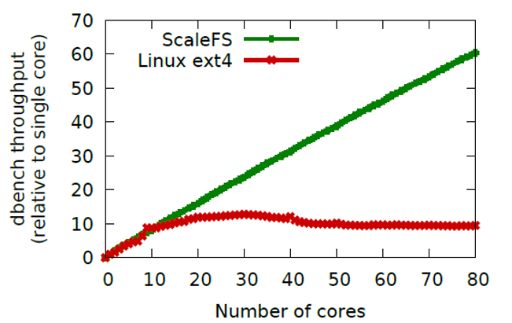

# An Empirical Study on the Correctness of Formally Verified Distributed Systems

## Summary of major innovations

该篇论文主要延续了十年前的在内核找Bug的论文An empirical study of operating systems errors思路，并且与之进行比较分析后得出目前内核目前的bug趋势和十年前已经有所差异了。从以往的driver中的bug相对较多当如今的arch和sound的比例也相对上升，内核bug的修复的主要方向可以做适当调整。

## Problems the paper mentioned

## Related works/papers

## Intriguing aspects of the paper

1. 

## Experiments: test/compare/analyze

实现是通过两方面来进行验证的，首先算是理论上的验证，利用SOSP13的Commutor来进行算是形式化的验证其的Conflict-free程度，如下图：

很明显，一片绿色通过的样子，基本上按照他这样实现方式，能够做到绝大部分情况都能保证Conflict-free，该没有冲突的情况都能做到没有冲突。

可以看到他的throughput很明显比ext4在核多的时候表现的非常好，而且整体也基本上成正比关系，最重要的是在核数比较少的情况下，他也和ext4有一较之力。

## Places the reseach can be improved

1. 首先就是这篇文章许多地方的对于bug的寻找都有些过于想当然，这应该是和十年前的想法类似。但是很明显的，比如对于Var这种类型的bug就只分析了直接声明超过1024的数组大小，而Block的初始函数也是认为制定的，而对于Size这个类型就是单纯的匹配kmalloc中的sizeof里的类型和返回值的类型是否一致等等。这样的分析有些过于粗犷了。
2. 也正是由于上面的分析过于粗犷，从而导致实际上寻找到的bug数量可能远远不止如此，也就是说，上面能找到的bug只是冰山一角而已。这样就使得文中实验部分的各种图表的意义都不是很大了，因为他只是局限在已经发现的部分中。而且这些通过简单的方式发现的很多时候一些注意的编程人员往往不会犯错，所以那些熟练编程人员易错的部分（往往后果也严重）完全不易被找到。
3. 这篇文章也提到就是可以减少False Positive，毕竟通过递归获得不动点集合以及模式匹配这样的方式并不能很好的理解内核的各种需求，所以有时候会导致各种误判。

## What I would do if i wrote this paper

如果是我来组织这篇文章的内容的话，除了他本身的组织方式意外，可能还会考虑使用另外一种组织方式，文章首先复现了Zhou的那篇文章的结果，也就是展示Linux 2.4相关的结果，然后再展示他们在2.6系列上的结果。不过还可以考虑按照不同的Bug类型来进行按照整个Linux Timeline进行展示和分析，因为除了分析文件夹（也就是内核模块）的各种趋势，其实不同Bug类型的趋势也是值得进一步分析和研究的。

## Survey Paper Lists

[1] A. Chou, J. Yang, B. Chelf, S. Hallem, and D. Engler. An empirical
study of operating systems errors. In Proceedings of the 18th ACM
Symposium on Operating System Principles, pages 73–88, Banff,
Canada, Oct. 2001.

[2] Comedi: Linux Control and Mesurement Device Interface. http:
//www.comedi.org/.

[3] Static source code analysis, static analysis, software quality tools by
Coverity Inc. http://www.coverity.com/, 2008.

